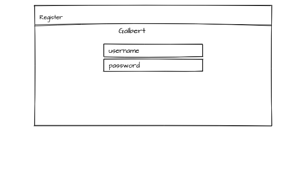
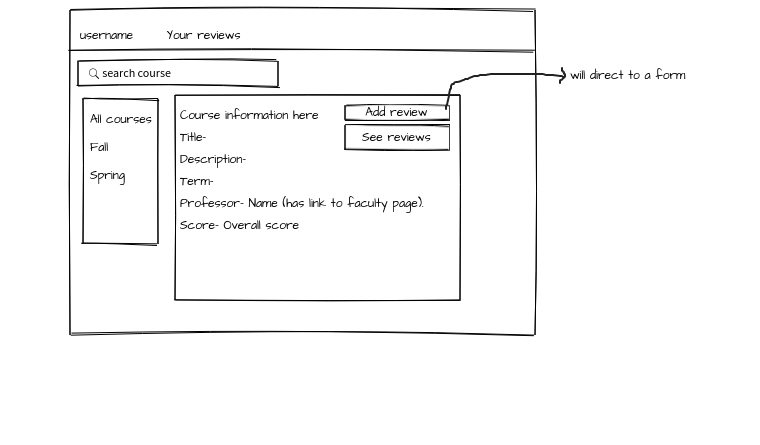
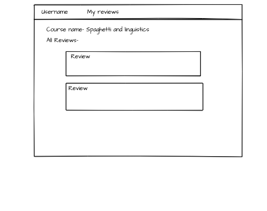
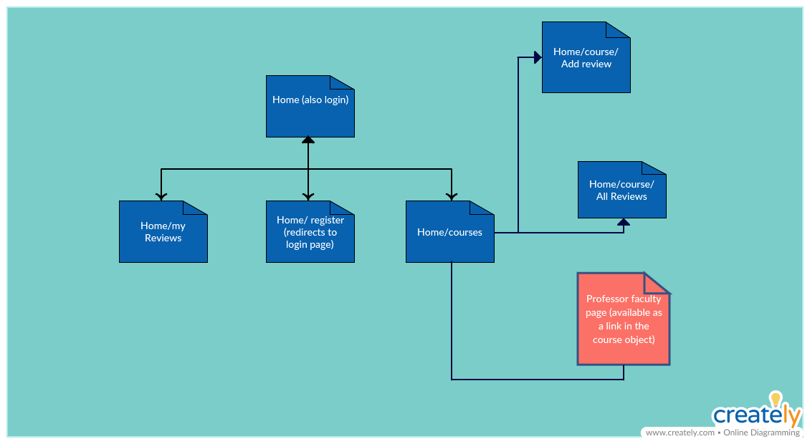

# GALBERT 

## Overview

Imagine that you're a gallatin student looking up courses and you find these classes that seem interesting but you have no idea whether the professor is good or not, what are his/her credentials or what even he/she looks like! That's where Galbert comes in!!

Its a course finder for Gallatin students that allows one to see and add reviews to a professor and at the same time links the professors nyu faculty page in the course description. Users can register and login, look up courses and add reviews to the courses that they have taken. The total reviews then get averagec and an overall score is assigned to the professor.  

## Link:


## Data Model
 
The application will store Users, Courses and Reviews

* users can look up their reviews tied to a specific course (via referencing)
* each review will contain the course name and the user submitting that review (via referencing)

An Example User:

```javascript
{
  username: "typicalStudent",
  hash: // a password hash,
}
```

An Example Review with Embedded Items:

```javascript
{
  username: // a reference to a User object
  course: { professor: "Modern Germany", course_id://some id, description: "Autobahn",},
  comment: //some comment on the course
}
```

## Wireframes

/Home- login page



/Home/courses - page displaying all courses



/Home/course/reviews - page for showing all reviews for a specific course



## Site map

  

## User Stories or Use Cases

1. as non-registered user, I can register a new account with the site
2. as a user, I can log in to the site
3. as a user, I can look up Gallatin courses on the site
4. as a user, I can add reviews to courses and professors in the site
5. as a user, I can check my professor's credentials on the site.

## [Link to Initial Main Project File](app.js) 


## Annotations / References Used

1. [passport.js authentication docs](http://passportjs.org/docs) - (add link to source code that was based on this)

